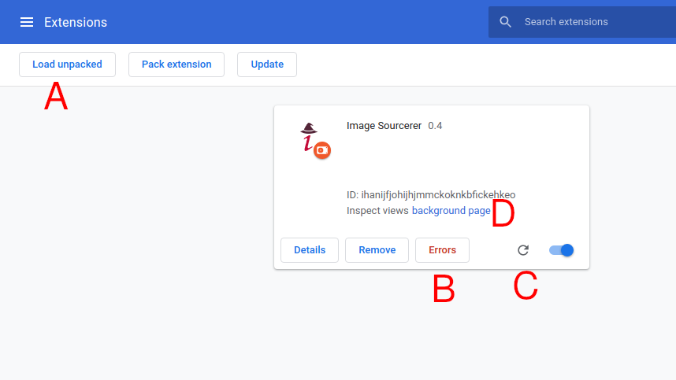

# Beta Testing Information

We are currently looking for beta testers!\
If you are interested, read the [Overview](#Overview) and [Joining the Program](#Joining-the-Program) sections.

# Contents
- [Overview](#Overview)
- [Installation and Extension Page](#Installation-and-Extension-Page)
- [Troubleshooting Issues](#Troubleshooting-Issues)
- [Providing Feedback](#Providing-Feedback)
- [Joining the Program](#Joining-the-Program)

# Overview
Welcome to the beta testing program for *Image Sourcerer*! The goal of this program is to find any bugs in the program as well as find ways to optimize the user experience. This page will be broken up into 4 sections (plus the overview). Please read all of them either before or after you join the program.\
Note that this is not just *load the extension and say "yeah, it's neat!"*. You will need to be providing feedback, suggestions, and any errors you encounter. Additionally, you should by *trying* to break it. Not messing with the code, but doing things that you might not normally do, just to see how the extension handles it.

# Installation and Extension Page
This section is pretty much the same as in `README.md`, except I'll talk a little more about the parts of the debugger so I can refer to them by their technical names in the future. For now, though, just follow these install instructions.
1. Download the program
  - Usually, that will be found on the [releases page](https://github.com/JakeGuy11/image-sourcerer/releases). The latest release will usually be at the top. To download it, scroll down to `assets` (without scrolling past the latest version), click it and download either the firefox or chrome zip file. Extract it to somewhere you will remember.
  - Sometimes, you'll have to test the working version (don't worry about that unless I ask you specifically). In this case, go to the [main page](https://github.com/JakeGuy11/image-sourcerer), click the green `code` button in the top right, and select download zip. Extract it to somewhere you'll remember.
2. Add the extension to chrome. Navigate to `chrome://extensions`. You'll have to enable developer mode by toggling the switch on the top right corner of the page. After that, click `Load unpacked` on the top left corner. Navigate to where you extracted the files and select open.
4. Use the extension. You should now be able to go to any supported site and start testing! Note: on Chrome and Chromium, you'll have to click the puzzle button in the top right corner of your *browser* to see the Image-Sourcerer icon. You can then click that to see the popup.

### Extension Page
The extension page is where you'll find most of the relevant information about errors.

\
***A***: Load unpacked. This is the button you'll click to open the folder containing the extension and load it. You shouldn't need it for much more.

***B***: Error log. This is where chrome will give you all the errors. It only appears when there is an error, so don't worry if it's not there for you.

***C***: Refresh. This will refresh the entire extension. You shouldn't have to use it too much.

***D***: Background console. A lot of errors will apear here as well as the error log, so I'll talk more about it later as well.

# Troubleshooting Issues
A lot of problems that seem like problems, actually aren't (they're called *surprise features*, not bugs!). I'll update this section in the future with issues that have come up that are easily fixable on the user's end and not under the control of the extension.

# Providing Feedback
In order to address and fix issues, I need to know what's happening in detail. A lot of times, I'll ask for you to do something specific and provide feedback, but here are some quick rules of thumb:
- Reporting a bug
  - Describe what is happening in detail
  - Describe when it happens
  - Provide any/all error messages from the background console, error log, and the page log (when you right click the page, click inspect, then in the window that opens, click console). A screenshot of these logs is fine.
- Suggesting a feature/ease of use
  - Describe your idea

# Joining the Program
To join the program, just contact me! Preferable on discord at JakeGuy11#1541, but email works fine as well, at Jake_Guy_11@protonmail.ch.\
If you have any questions, also contact me at one of the above socials.
